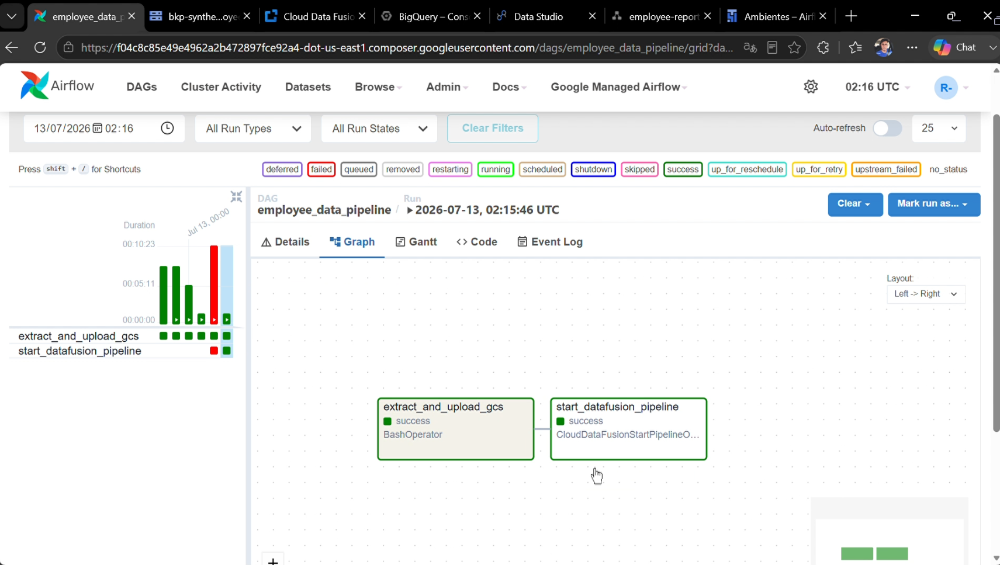
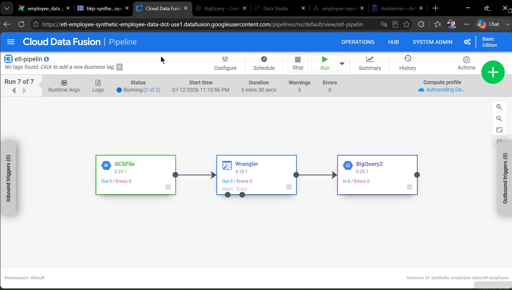
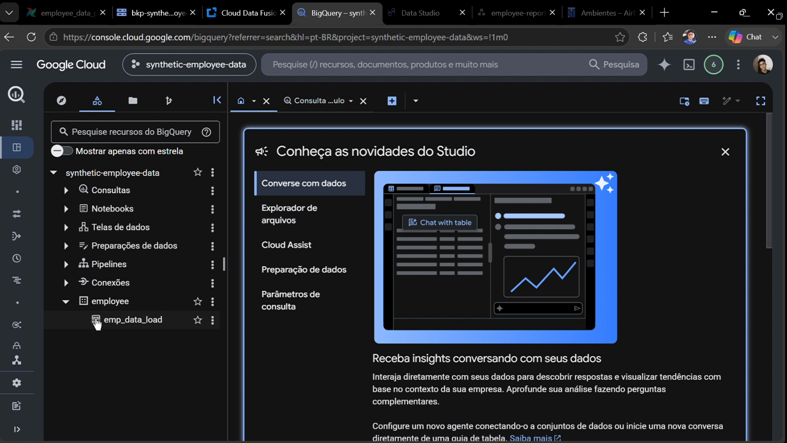
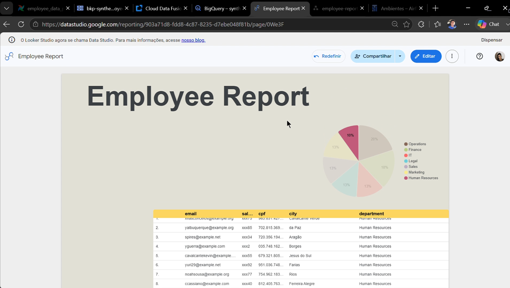

# ETL Pipeline com Google Cloud Data Fusion, Cloud Composer e BigQuery

## 📌 Sobre o Projeto

Este projeto demonstra a construção de um pipeline **ETL (Extract, Transform and Load)** de ponta a ponta utilizando serviços da **Google Cloud Platform (GCP)**.

O objetivo é automatizar o processo de ingestão, transformação e carregamento de dados de funcionários, utilizando uma arquitetura moderna baseada em serviços gerenciados da Google Cloud.

O pipeline realiza a extração dos dados através de um script Python, armazena os arquivos no **Google Cloud Storage**, executa transformações utilizando o **Cloud Data Fusion** e disponibiliza os dados tratados no **Google BigQuery** para análises.

Todo o fluxo é orquestrado pelo **Apache Airflow**, executado no **Cloud Composer**.

---

# 🏗 Arquitetura

```text
                    +----------------------+
                    |  Python (Extract)   |
                    +----------+-----------+
                               |
                               v
                  Google Cloud Storage
                               |
                               v
                Cloud Data Fusion Pipeline
            - Data Masking
            - Data Encoding
            - Data Transformation
                               |
                               v
                     Google BigQuery
                               ^
                               |
           Cloud Composer (Apache Airflow)
```

---

# 🔄 Fluxo do Pipeline

1. Extração dos dados utilizando Python.
2. Upload do arquivo para o Google Cloud Storage.
3. O Apache Airflow inicia automaticamente o pipeline do Cloud Data Fusion.
4. O Cloud Data Fusion realiza:
   - Mascaramento de dados sensíveis;
   - Transformações dos dados;
   - Codificação de atributos.
5. Os dados tratados são carregados no Google BigQuery.
6. Os dados ficam disponíveis para consultas analíticas e dashboards (Looker studio).

---

# ☁️ Serviços Google Cloud Utilizados

- Cloud Composer (Apache Airflow)
- Cloud Data Fusion
- Cloud Storage
- BigQuery

---

# 🛠 Tecnologias Utilizadas

- Python
- Apache Airflow
- Google Cloud Platform
- Cloud Composer
- Cloud Data Fusion
- Google Cloud Storage
- Google BigQuery
- SQL

---

# ⚙️ Orquestração com Apache Airflow

O Airflow é responsável por controlar todo o fluxo do pipeline.

Fluxo da DAG:

```text
Extract Data
      │
      ▼
Upload para Cloud Storage
      │
      ▼
Executar Pipeline no Cloud Data Fusion
      │
      ▼
Carregar Dados no BigQuery
```

---

# 🔄 Cloud Data Fusion

O pipeline do Cloud Data Fusion é responsável por:

- Ler os dados armazenados no Cloud Storage;
- Aplicar mascaramento em informações sensíveis;
- Realizar transformações dos dados;
- Codificar atributos categóricos;
- Carregar os dados processados no BigQuery.

---

# 📊 Google BigQuery

Após o processamento, os dados são carregados automaticamente no BigQuery, onde ficam disponíveis para:

- Consultas SQL;
- Dashboards;
- Business Intelligence;
- Análises de dados.

---

# 🚀 Como Executar

## Pré-requisitos

- Projeto na Google Cloud Platform
- Cloud Composer
- Cloud Data Fusion
- Bucket no Cloud Storage
- Dataset no BigQuery

### Passos

1. Faça o upload da DAG para o bucket do Cloud Composer.
2. Faça o upload do script Python para a pasta `scripts`.
3. Crie o pipeline no Cloud Data Fusion.
4. Configure a conexão com o BigQuery.
5. Execute a DAG pelo Apache Airflow.

---

# 📸 Demonstração

Adicionar imagens como:

- DAG executando no Airflow

- Pipeline no Cloud Data Fusion

- Dados carregados no BigQuery

- Informações no BI


---

# 📄 Licença

Este projeto foi desenvolvido para fins de estudo, demonstração técnica e composição de portfólio.
